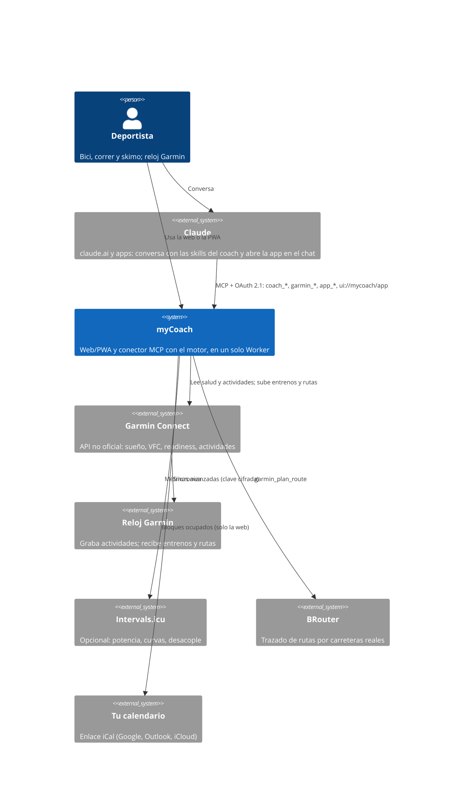
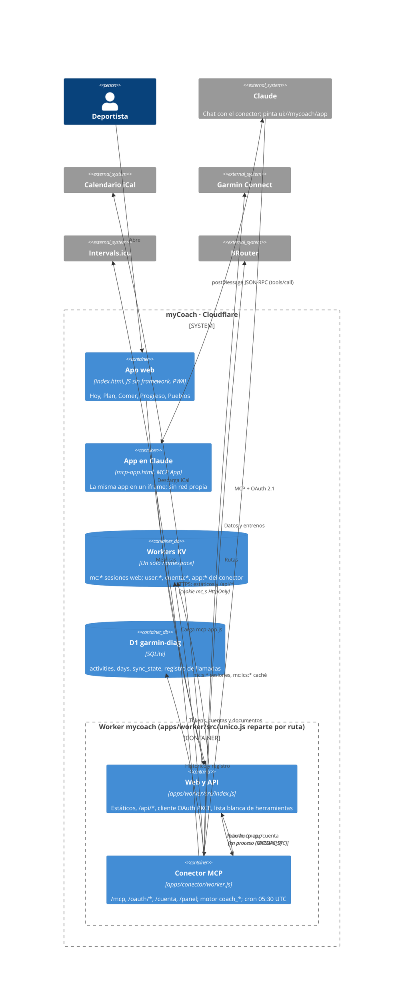
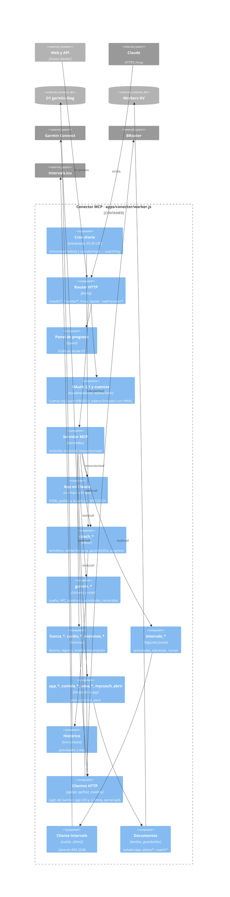
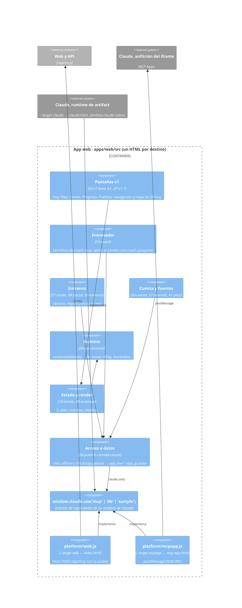
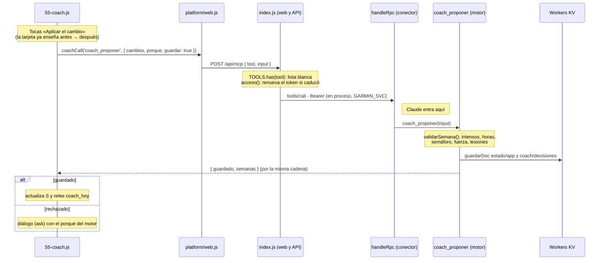

# Arquitectura de myCoach en C4

Cuatro niveles, de fuera hacia dentro: con quién habla myCoach, qué se despliega, qué hay dentro de cada pieza y cómo viaja una llamada concreta. Cubre todo el repo, conector incluido (`apps/conector`). Estado a 3 de octubre de 2026.

Versión dibujada (más legible, claro y oscuro): https://claude.ai/artifact/JJxEwkUSQ2j51EmHubinio

## C1 · Contexto

Dos puertas al mismo entrenador: la app (web o PWA) y el Claude de cada uno. Las dos acaban en el mismo sistema, que es el único que habla con Garmin.

- El método (semáforo, reglas del plan) vive en el conector (`coach_*`). La web y Claude lo enseñan y lo explican.
- Claude no habla con Garmin: llama a las herramientas de myCoach, igual que la web.

## C2 · Contenedores

- Una URL para todo: `unico.js` manda `/mcp`, `/oauth/*`, `/cuenta`, `/panel`, `/.well-known/*` y los GPX al conector, y el resto a la web. Tu Claude se conecta a `…/mcp` del mismo dominio.
- Las dos partes se llaman en proceso: `unico.js` les da un `GARMIN_SVC` y un `MYCOACH` que llaman al `fetch()` de la otra, así que su código no cambió al juntarlas.
- `SESIONES` (web) y `GARMIN` (conector) son el mismo namespace de KV; la web escribe bajo `mc:`.
- La app en Claude no tiene flecha hacia el conector: no tiene red y todo se lo pide a Claude.
- `mycoach-pruebas` (sin cron) comparte KV y D1 con producción: datos reales.
- Despliegue: GitHub Actions, `npm run check` (web, Worker y tests del conector) en cada push; en `main`, `wrangler deploy` con `SIGNING_KEY` como secreto y comprobación de la web, la API y el login.

## C3 · Componentes

### Conector MCP (`apps/conector/worker.js`)

`coach_*` también lee documentos (plan, perfil, diario) y la salud de hoy de Garmin.

### App web (`apps/web`)

`apps/web/build.mjs` elige la plataforma y mete en el mismo HTML la geografía (IGN y Natural Earth, 1,8 MB), `demo.json` y los módulos `00…99` en orden.

## C4 · Código: «Aplicar el cambio»

El semáforo de Hoy propone recortar la sesión y tocas el botón.

Desde Claude la llamada entra directamente en `handleRpc` y desde ahí es idéntica: mismo motor, mismas reglas, mismo documento.

## Puntos a vigilar

- **API privada de Garmin.** Ya se rompió en marzo de 2026 y el programa oficial no acepta solicitudes. Intervals.icu es el plan B.
- **Pruebas y producción comparten datos.** Un cambio guardado desde `mycoach-pruebas` se ve en la web de siempre.
- **Un archivo para todo el conector.** `apps/conector/worker.js` (~6.500 líneas) mezcla OAuth, cliente de Garmin, motor y entrenos; separar el motor a `packages/domain` está en el plan.
- **HTML pesado.** La geografía va incrustada en la web; el plan es cargarla bajo demanda.
