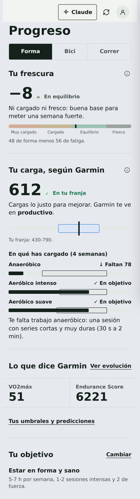
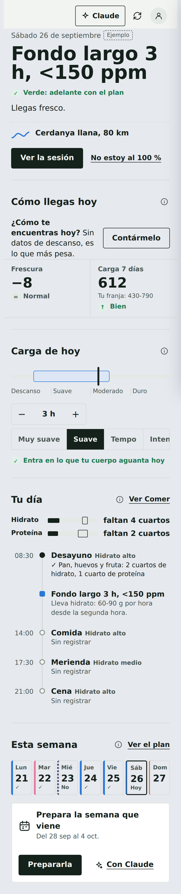
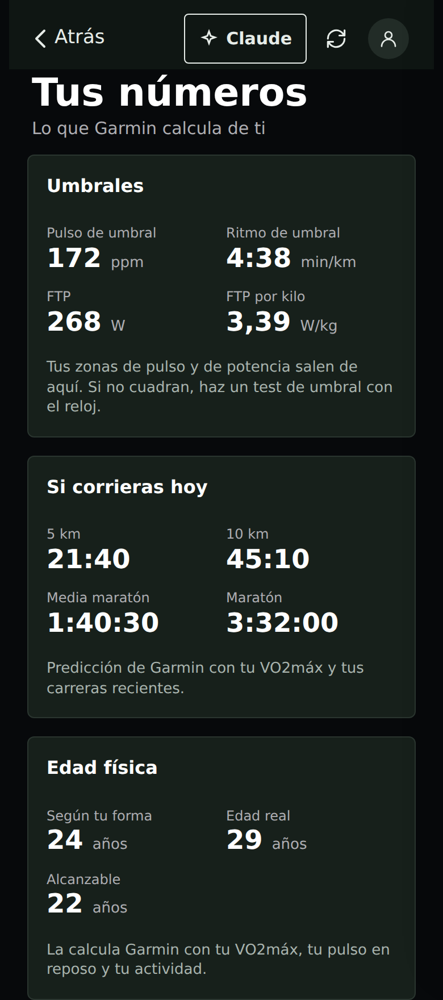

# Garmin Connect: todo lo que ofrece y qué usa myCoach

Octubre de 2026. Garmin no publica esta API: es la que usan su web y su app
(`connectapi.garmin.com`). Este inventario sale de las llamadas de
[python-garminconnect](https://github.com/cyberjunky/python-garminconnect)
(la librería de referencia, unas 120) y de lo que el conector ya usaba. Puede
haber rutas que Garmin no documenta en ningún sitio: para esas está `garmin_api`.

## 1. Carga: los tres conceptos de Garmin

En Garmin Connect, dentro de **Carga**, salen tres cosas distintas:

| Garmin lo llama | Qué es | Dónde está en la API | En myCoach |
|---|---|---|---|
| **Exercise Load** (carga del ejercicio) | La carga de **una actividad**. Garmin la estima a partir del EPOC (cuánto te ha sacado de tu equilibrio), así que una hora suave carga poco y 20 min de series cargan mucho. | `activityTrainingLoad` en el resumen de cada actividad (`activitylist-service/.../search/activities`, `activity-service/activity/{id}`) y en `fitnessstats-service/activity/all` | Antes solo en `garmin_activity_detail`. **Ahora** también en `garmin_activities` (`carga_garmin`) y sumada por semana y deporte en `garmin_forma` (`carga_por_semana`). |
| **Training Load / Acute Load** (carga aguda) | La suma ponderada de las Exercise Load de **los últimos 7 días**. Se compara con una **franja óptima** que sale de tu carga crónica (28 días): por debajo pierdes forma; por encima, riesgo. El cociente aguda/crónica es el ratio (ACWR). | `trainingstatus/aggregated/{fecha}` → `latestTrainingStatusData[reloj].acuteTrainingLoadDTO` (aguda, crónica, `min/maxTrainingLoadChronic`, ratio, `acwrStatus`) y `weeklyTrainingLoad` con `loadTunnelMin/Max` | Antes: aguda, crónica y ratio, sin la franja. **Ahora** completo en `garmin_forma.carga`. |
| **Load Focus** (enfoque de carga) | El reparto de **las últimas 4 semanas** en tres cubos: **anaeróbico**, **aeróbico intenso** y **aeróbico suave**, cada uno con el rango objetivo para tu nivel. El veredicto dice qué falta ("Falta anaeróbico"). | `trainingstatus/aggregated` → `mostRecentTrainingLoadBalance`, o `trainingloadbalance/latest/{fecha}` | Ya estaba (`balance_carga_mes` en `garmin_training_readiness`, la web lo guarda). **Ahora** traducido en `garmin_forma.enfoque_carga`. |

Junto a la carga, Garmin pone el **Training Status** (Productivo,
Mantenimiento, Pérdida de forma, Sobrecargado…). Sale de cruzar la tendencia
del VO2máx con la carga aguda. Antes se devolvía el código numérico; ahora va
traducido y del reloj principal.

## 2. Inventario por áreas

Leyenda: ✅ herramienta propia · 🟡 a medias · 🔎 solo con `garmin_api`.

### Forma y carga
| Dato | Endpoint | Estado |
|---|---|---|
| Training Status, carga aguda/crónica con franja, ratio, carga semanal, aclimatación | `metrics-service/metrics/trainingstatus/aggregated/{fecha}` | ✅ `garmin_forma` |
| Training Status de cada día (historia) | `metrics-service/metrics/trainingstatus/daily/{fecha}` | 🔎 |
| Load Focus | `metrics-service/metrics/trainingloadbalance/latest/{fecha}` | ✅ `garmin_forma` |
| Exercise Load por actividad | `fitnessstats-service/activity/all` · lista de actividades | ✅ `garmin_activities`, `garmin_forma` |
| Training Readiness y factores | `metrics-service/metrics/trainingreadiness/{fecha}` | ✅ `garmin_training_readiness` (🟡 no devuelve todos los factores: estrés, historial de VFC, carga) |
| VO2máx correr y bici (serie) | `metrics-service/metrics/maxmet/daily/{desde}/{hasta}` | ✅ `garmin_forma` |
| Endurance Score (día y serie) | `metrics-service/metrics/endurancescore[/stats]` | ✅ `garmin_forma` |
| Hill Score (día y serie) | `metrics-service/metrics/hillscore[/stats]` | ✅ `garmin_forma` |
| Running Tolerance | `metrics-service/metrics/runningtolerance/stats` | 🔎 |
| Predicciones de carrera (últimas y su evolución) | `metrics-service/metrics/racepredictions/latest|daily|monthly/{usuario}` | ✅ últimas · 🔎 evolución |
| Edad física | `fitnessage-service/fitnessage/{fecha}` | ✅ `garmin_forma` |
| Aclimatación al calor y la altitud | dentro de `trainingstatus/aggregated` y `maxmet` | ✅ `garmin_forma` |

### Umbrales y zonas
| Dato | Endpoint | Estado |
|---|---|---|
| Umbral de lactato (pulso, ritmo) | `biometric-service/biometric/latestLactateThreshold` | ✅ `garmin_forma` |
| FTP | `biometric-service/biometric/latestFunctionalThresholdPower/CYCLING` | ✅ `garmin_forma` |
| Potencia de umbral y W/kg | `biometric-service/biometric/powerToWeight/latest/{fecha}` | 🔎 |
| FTP, pulso y velocidad de umbral en el tiempo | `biometric-service/stats/{functionalThresholdPower|lactateThresholdHeartRate|lactateThresholdSpeed}/range/...` | 🔎 |
| Zonas de pulso y de potencia | `biometric-service/heartRateZones`, `powerZones/sports/all` | 🔎 |

### Actividades
| Dato | Endpoint | Estado |
|---|---|---|
| Lista con resumen | `activitylist-service/activities/search/activities` | ✅ `garmin_activities` |
| Resumen, series, zonas de pulso | `activity-service/activity/{id}[/details|/hrTimeInZones]` | ✅ `garmin_activity_detail` |
| Series de fuerza | `.../exerciseSets` | ✅ `fuerza_desde_garmin` |
| Recorrido | `.../details` (polilínea) | ✅ `garmin_activity_route` |
| Vueltas, tramos por tipo, resumen de tramos | `.../splits`, `/typedsplits`, `/split_summaries` | 🔎 |
| Zonas de potencia | `.../powerTimeInZones` | 🔎 |
| Tiempo que hacía | `.../weather` | 🔎 (Intervals.icu lo da) |
| Récords personales | `personalrecord-service/personalrecord/prs/{usuario}` | 🔎 |

### El día: sueño y recuperación
| Dato | Endpoint | Estado |
|---|---|---|
| Resumen diario (pasos, reposo, estrés, Body Battery) | `usersummary-service/usersummary/daily/{usuario}` | ✅ `garmin_daily_summary` |
| Sueño de una noche | `wellness-service/wellness/dailySleepData/{usuario}` | ✅ `garmin_sleep` |
| Sueño de muchas noches de golpe | `sleep-service/stats/sleep/daily/{desde}/{hasta}` | 🔎 (hoy se pide noche a noche) |
| VFC (noche y serie) | `hrv-service/hrv/{fecha}`, `hrv/daily/{desde}/{hasta}` | ✅ noche · 🔎 serie |
| Body Battery (y sus eventos) | `bodyBattery/reports/daily`, `bodyBattery/events/{fecha}` | ✅ · 🔎 eventos |
| Estrés de todo el día, estrés semanal | `wellness/dailyStress/{fecha}`, `stats/stress/weekly` | 🔎 |
| Pulso de todo el día, reposo en serie | `wellness/dailyHeartRate`, `userstats-service/wellness/daily` | 🔎 |
| Respiración, SpO2 | `wellness/daily/respiration|spo2/{fecha}` | 🔎 |
| Minutos de intensidad, pasos, pisos | `wellness/daily/im`, `stats/im/weekly`, `stats/steps/...`, `floorsChartData` | 🔎 |
| Hidratación, hábitos | `usersummary/hydration/daily`, `lifestylelogging-service/dailyLog` | 🔎 |

### Cuerpo y salud
| Dato | Endpoint | Estado |
|---|---|---|
| Peso | `weight-service/weight/range/...` | ✅ `peso_historico` |
| Composición corporal (grasa, músculo, agua) | `weight-service/weight/dateRange` | 🔎 |
| Tensión arterial | `bloodpressure-service/bloodpressure/range/...` | 🔎 |
| Ciclo menstrual, embarazo | `periodichealth-service/...` | 🔎 |
| Comida registrada en Garmin | `nutrition-service/...` | 🔎 (myCoach tiene la suya) |

### Plan, material y perfil
| Dato | Endpoint | Estado |
|---|---|---|
| Entrenos guardados | `workout-service/workouts` | ✅ `entrenos_desde_garmin` |
| Calendario de Garmin | `calendar-service/year/{año}/month/{mes}` | 🔎 |
| Planes de Garmin Coach y adaptativos | `trainingplan-service/...` | 🔎 |
| Objetivos | `goal-service/goal/goals` | 🔎 |
| Recorridos | `course-service/...` | ✅ `garmin_courses` |
| Material (zapatillas, bicis) y su desgaste | `gear-service/...` | 🔎 |
| Relojes, reloj principal, carga solar | `device-service/...`, `web-gateway/...` | 🔎 |
| Ajustes del usuario | `userprofile-service/userprofile/user-settings` | 🟡 (edad, peso y umbral en `garmin_training_readiness`) |
| Insignias y retos | `badge-service`, `badgechallenge-service` | 🔎 |

**No se exponen nunca:** login y tokens (`di-oauth2-service`, `sso`), subidas
(`upload-service`) y descargas de archivos FIT/GPX (`download-service`), y nada
que escriba (borrar actividades, cambiar ajustes…). Las escrituras que ya hay
(recorridos, entrenos, peso) siguen con su herramienta y su confirmación.

## 3. `garmin_api`: que Claude no esté ciego

`garmin_api` es el respaldo para lo que myCoach no tiene:

- **Sin `path`**, devuelve el catálogo de arriba por grupos, con qué da cada ruta.
- **Con `path`**, hace un GET y devuelve el JSON de Garmin **tal cual**: si mañana Garmin añade un campo, se ve sin tocar myCoach.
  - `{usuario}` y `{perfil}` los rellena el conector.
  - Un valor lista en `params` se repite (`metric=a&metric=b`).
- **Respuestas grandes:** no se cortan a ciegas. Vuelven los campos pequeños y la lista de los grandes con su tamaño, para pedirlos con `campos` (rutas con puntos).
- **Solo lectura:** nunca escribe. No toca login, subidas ni descargas.
- **Rutas que fallan:** una que no existe da 404 y remite al catálogo. Una vacía (204) es "sin datos", no un error.

Las instrucciones del conector le dicen a Claude que, si ninguna herramienta
trae el dato, mire el catálogo y lo pida con `garmin_api` en vez de decir que
no lo tiene.

**Riesgo:** Claude puede leer algo pesado y gastar contexto. Lo frena el
recorte. Las herramientas propias siguen siendo mejores para lo habitual,
porque interpretan y traducen.

## 4. En la app (hecho el 4 de octubre)

La regla del repo: cada pantalla responde a una pregunta, y un dato no se
repite. No se pinta todo lo que da Garmin, solo lo que ayuda a decidir.

1. **Progreso → Forma: "Tu carga, según Garmin".** Responde a "¿me estoy pasando o me quedo corto?":
   - la carga de 7 días frente a su franja óptima, con su lectura en texto y el estado de Garmin;
   - debajo, el Load Focus en tres barras con su objetivo y qué hacer.
   En escritorio va al lado de la frescura.
2. **Evolución:** VO2máx de correr y de bici, Endurance y Hill salen de `garmin_forma`. Es **1 llamada en vez de 13**.
3. **Actividad:** su carga de Garmin (Exercise Load).
4. **Progreso → "Tus umbrales y predicciones"**: umbral (pulso y ritmo), FTP y W/kg, predicciones de carrera, edad física y aclimatación. Es de consulta.
5. **Hoy:** la carga de 7 días, el estado de Garmin y el estrés de ayer son datos más del semáforo, con su explicación. No hay tarjetas nuevas.
6. **Sin datos de descanso** (solo un Edge, o un reloj que no se lleva de noche): ver la sección 7.

| Progreso: tu carga | Hoy sin reloj (solo un Edge) | Tus números |
|---|---|---|
|  |  |  |

Capturas a 390 px con los datos de la demo.

## 5. Las herramientas del MCP (hecho el 4 de octubre)

De 47 herramientas a **40, de las que Claude ve 36**. No se pierde nada, porque lo que no tenga herramienta lo alcanza `garmin_api`.

| Antes | Ahora |
|---|---|
| `garmin_daily_summary`, `garmin_sleep`, `garmin_hrv`, `garmin_body_battery`, `garmin_training_readiness` | **`garmin_dia`**: un día entero (más estrés, respiración y SpO2, y los factores del readiness), con `partes`; o la serie de varios días con `dias`. |
| El perfil de Garmin (`perfil_garmin`) dentro del readiness | En **`garmin_forma`**: `persona`, y el nivel de Endurance con el siguiente. |
| `garmin_courses` + `garmin_course_detail` | **`garmin_courses`** (con `course_id`, el detalle). |
| `fuerza_entrenos` + `cardio_entrenos` | **`entrenos`** (con `tipo`). |
| `fuerza_enviar_garmin` + `cardio_enviar_garmin` | **`entreno_enviar_garmin`** (con `tipo`). |
| `app_guardar`, `intervals_conectar`, `intervals_desconectar`, `fuerza_dia` | Siguen, pero **solo para la app** (`_meta.ui.visibility: ["app"]`): Claude no las ve. |

Las convenciones para seguir creciendo sin romper están en el README del
conector ("Convenciones de las herramientas"), y las comprueba un test.

## 7. Quien no tiene reloj (solo un Edge)

Un Edge mide las salidas, pero no el sueño, la VFC, el pulso en reposo ni el
readiness. Enseñar esos huecos todos los días no aporta nada, así que:

- **El conector lo detecta por los datos** (`fuentes`): mira qué ha llegado en las dos últimas semanas. No usa el modelo del dispositivo, así que también sirve para quien tiene reloj pero no duerme con él (entonces falta el sueño y la VFC, pero sale el pulso).
- **Lo que no se mide no se enseña.** No aparece como "sin dato" ni cuenta como dato que falta.
- **El semáforo decide con lo que hay:** la frescura, la carga de 7 días de Garmin y su estado (los da el Edge), y lo que cuentes.
- **Hoy cambia:**
  - "Tus datos de esta noche" pasa a "Cómo llegas hoy";
  - la pregunta "¿Cómo te encuentras hoy?" va primero, con su botón, porque es lo que más pesa;
  - el mensaje del entrenador lo pide si no lo has contado.
- **Claude lo sabe:** las instrucciones le dicen que no pida datos de sueño a quien no los tiene.

## 8. Qué falta comprobar

- Ningún endpoint nuevo se ha probado aún contra una cuenta real: los tests usan respuestas simuladas con la forma que documenta la librería. Se prueba en `mycoach-pruebas` (workflow CI → Run workflow desde la rama).
  - `garmin_api` sin path y luego, por ejemplo, `/metrics-service/metrics/trainingloadbalance/latest/{hoy}`.
  - `garmin_forma` con `semanas: 12`.
- **Ritmo del umbral:** al parecer Garmin da la velocidad del umbral en decenas de m/s y `garmin_forma` la convierte con esa suposición. Si el ritmo sale raro, es ahí.
- **`{perfil}`** (para el material) se saca de `socialProfile.profileId`. Si Garmin no lo da, habrá que leerlo de otro sitio.
- **`garmin_dia`** y la detección de `fuentes`: comprobar con una cuenta real con reloj y con otra que solo tenga un Edge.
- **Skills de Claude:** ya viven en `apps/skills` y están al día. Hay que subirlas a Claude (`npm run skills`) cuando se despliegue el conector.
