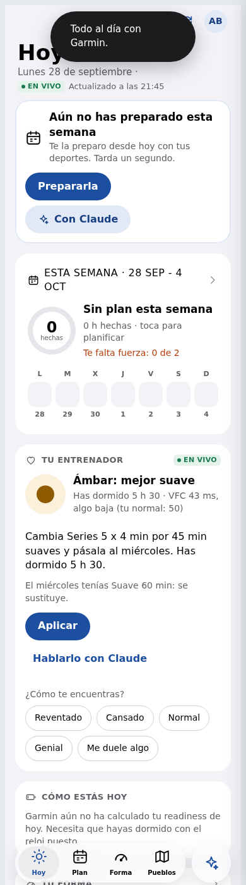

# Probar el entrenador (trabajo de la noche del 28 de septiembre)

Nada de esto está en `main` ni en producción. Todo está en ramas
`ccr-3045247d-qwz39a` de los dos repos, y se prueba en **dos Workers de pruebas
aparte** que tienes que desplegar tú con un botón.

## 1. Qué hemos hecho

Es el primer paso del plan (`docs/PLAN-COACH.md`): **el motor decide, el modelo explica.**

- **En el conector (repo `garmin-mcp`)** hay 6 herramientas nuevas, `coach_*`, que son el método de myCoach:
  - `coach_hoy` es el **semáforo del día** (🟢 🟠 🔴) con sus razones. Mira el readiness, la VFC y el pulso en reposo comparados con tu mediana de 28 días, las horas de sueño, la frescura (TSB, del modelo de carga que ya tenía el panel) y lo que hayas anotado. Si hace falta, **propone** cambiar, recortar o mover la sesión de hoy, y trae un mensaje ya redactado.
  - `coach_semana`: lo previsto frente a lo hecho, día a día. Incluye la carga de la semana frente a tu media de 4 semanas y avisos (subes demasiado rápido, toca descarga, falta fuerza…).
  - `coach_proponer`: cualquier cambio de plan pasa por aquí. El motor lo **valida** con las reglas: máximo de intensos según tu objetivo, nada de intensos seguidos, nada exigente en rojo, horas, fuerza y lesiones. Si no cumple, **no guarda** y devuelve una versión corregida. El porqué de cada cambio queda en un registro de decisiones.
  - `coach_perfil` / `coach_perfil_guardar`: la memoria del deportista (objetivo con fecha, disponibilidad, lesiones, preferencias).
  - `coach_anotar`: "estoy reventado", "me duele la rodilla"… Un dolor pone el día en rojo.
  - Las **instrucciones del conector** llevan la voz y el método del entrenador, así que tu Claude habla como él sin que le digas nada.
  - Cada mañana, el cron deja calculado el semáforo de quien usa myCoach (preparado para los avisos que vendrán).
  - Hay 45 tests nuevos (216 en total, todos en verde).
- **En la web (repo `myCoach`)** hay una tarjeta nueva en Hoy, **"Tu entrenador"**. Enseña el semáforo, sus razones y el mensaje. Tiene los botones **Aplicar** y **Hablarlo con Claude**, y los de "¿Cómo te encuentras?" (Reventado, Cansado, Normal, Genial, Me duele algo). No calcula nada: se lo pide al conector. En modo demo enseña un ejemplo con las mismas reglas.
- **Entorno de pruebas:** `garmin-pruebas` y `mycoach-pruebas`, otros dos Workers con el código de estas ramas.



### Cambios del 29 de septiembre
- **Una sola tarjeta en Hoy**: el semáforo y, debajo, *Por qué*, con cada dato (readiness, sueño, VFC, pulso en reposo, frescura y lo anotado) comparado con lo normal para ti y con un punto de color según cómo lo lee el motor. Sustituye a "Cómo estás hoy".
- **Nombre del entrenador**: en Ajustes → *Nombre de tu entrenador* (por defecto myCoach). También puedes decírselo a Claude ("a partir de ahora te llamas Rafa"). Se guarda en tu perfil del conector y las instrucciones del conector lo usan, así que tu Claude se presenta con ese nombre en los chats nuevos.
- **Deportes**: el entrenador solo planifica bici, correr y skimo (y fuerza como complemento). Si metes otro deporte en el plan, lo acepta con un aviso: cuenta como carga, pero no lo planifica.
- 223 tests en verde en el conector.

### Cambios del 29 de septiembre (tarde)
- **Todas las métricas de cada actividad** (`garmin_activity_detail`): velocidad media y máxima, ritmo y ritmo ajustado a la pendiente, potencia media y normalizada, IF, TSS, cadencia, dinámicas de carrera (zancada, contacto con el suelo, oscilación), velocidad vertical, temperatura, efecto de entrenamiento y **stamina** si tu reloj la graba. Lo que no reconoce también sale, con su nombre de Garmin.
- **Gráficas sin capturas:** cada actividad trae todas sus series resumidas (mínimo, media, máximo, inicio y final) y un **perfil de 24 tramos** con velocidad, pulso, potencia, cadencia, altitud y stamina. Las instrucciones del conector le dicen a Claude que nunca pida pantallazos.
- **`coach_progreso`**: "¿estoy mejorando en bici?" → semana a semana, velocidad, ritmo, VAM, pulso, potencia, cadencia y eficiencia (metros por latido); últimas 4 semanas frente a las 4 anteriores y mejores registros. `coach_semana` enseña esas métricas en cada sesión hecha.
- **Intervals.icu**: se conecta en Ajustes con tu ID de atleta y tu clave (se guarda cifrada). Añade `intervals_actividades`, `intervals_actividad` (intervalos y series), `intervals_bienestar` e `intervals_curvas` (mejores marcas de potencia, ritmo y pulso).
- **Diseño revisado** (reglas en `CLAUDE.md`):
  - Hoy empieza por el entrenador ("qué hago hoy y por qué").
  - El cambio propuesto se enseña como antes → después.
  - Los estados llevan texto e icono, no solo color.
  - "Cómo te encuentras" es una hoja con opciones en vez de cinco botones.
  - Ajustes, ordenado en Conexiones, Tu entrenador, Deportes que entreno, Preferencias, Tú y Datos.
- 264 tests en verde en el conector.

### Cambios del 29 de septiembre (noche)
- **myCoach dentro de Claude (MCP Apps).** Nueva herramienta `mycoach_abrir`: Claude abre **la app entera** dentro de la conversación (Hoy, Plan, Forma, Pueblos o Ajustes). Es la misma app, con una plataforma que pide los datos a Claude en vez de a nuestro servidor. Lee y guarda lo mismo que la web y el chat. Sigue el tema claro u oscuro de Claude, se puede poner a pantalla completa, y "Hablarlo con Claude" escribe directamente en la conversación.
- **Arreglado: el plan subido desde Claude desaparecía.** Había dos fallos:
  - `app_guardar` no explicaba el formato del plan. Ahora lo explica, dice que para el plan se use `coach_proponer`, y traduce los nombres de campo que se invente Claude (`tipo`, `titulo`, `detalle`, `duracion_min`…) al formato de la app. Lo que no entiende lo rechaza explicando el formato.
  - La web guardaba el documento entero con su copia local y **pisaba** lo que Claude acababa de escribir. Ahora cada guardado lleva la versión que conoce: si Claude ha cambiado algo después, el conector no guarda y la app recarga.
- 279 tests en verde en el conector. La app dentro de Claude se ha probado con un anfitrión MCP Apps simulado.

## 2. Cómo se conecta con tu Claude

```
                    ┌──────────────── Worker del conector (garmin / garmin-pruebas) ───────────────┐
Tu Claude ──MCP──►  │ garmin_*  (lee Garmin)                                                       │
 (claude.ai,        │ coach_*   (MOTOR: semáforo, reglas del plan, validación)  ◄── cron 7:30      │
  app, móvil)       │ app_*     (estado de la app)                                                 │
                    │        │                          │                                          │
                    │   KV: estado/app (plan)   D1: histórico de actividades y días (forma)        │
                    │       atleta/perfil, atleta/diario, coach/hoy, coach/decisiones              │
                    └──────────────────────────────────▲───────────────────────────────────────────┘
                                                       │ mismas herramientas (proxy /api/mcp)
Web myCoach (mycoach / mycoach-pruebas) ───────────────┘
```

- **Tu Claude no paga nada extra.** Usa tu plan de Claude y llama a las herramientas del conector igual que ya hace con `garmin_*`. La "inteligencia de entrenador" no la pone el modelo: la ponen las herramientas (el motor) y las instrucciones del conector (la voz).
- **La web y tu Claude comparten estado.** Si Claude te mueve una sesión con `coach_proponer`, la ves en la web al volver a abrirla, porque escribe en el mismo `estado/app`. Y al revés: el plan que haces en la web es el que ve Claude.
- **Mismo método en los dos sitios.** El botón Aplicar de la web usa `coach_proponer`, igual que Claude. Si el motor dice que no, dice que no en los dos.

## 3. Pasos para probar

### A. En tu Claude (lo importante, unos 10 minutos)

1. **Despliega el conector de pruebas.** GitHub → repo `garmin-mcp` → *Actions* → **Deploy** → *Run workflow* → en *Use workflow from* elige la rama **`ccr-3045247d-qwz39a`** → *Run*.
   - Desde una rama que no es `main`, el workflow **solo** despliega `garmin-pruebas`. Tus conectores `garmin` y `garmin-2` no se tocan.
   - Cuando acabe en verde, comprueba que `https://garmin-pruebas.albertbecervas.workers.dev/.well-known/oauth-authorization-server` contesta.
2. **Añádelo en Claude.** Ajustes → Conectores → Añadir conector personalizado → nombre `myCoach pruebas`, URL `https://garmin-pruebas.albertbecervas.workers.dev/mcp`. Te sale la pantalla de login de Garmin de siempre.
3. **Abre un chat nuevo y deja activo solo este conector.** En el menú de herramientas del chat, desactiva "Garmin" y "Garmin-Paula" para esa conversación: tienen herramientas con el mismo nombre y Claude podría usar la versión vieja.
4. **Prueba estas frases** (y mira qué herramientas llama Claude, se ve en el chat):

   | Dices | Debería pasar |
   |---|---|
   | "¿Qué hago hoy?" | Llama a `coach_hoy` y te da el semáforo, el porqué y qué hacer. No se inventa otra cosa. |
   | "¿Cómo va mi semana?" | `coach_semana`: hecho frente a previsto, carga frente a tu media, avisos. |
   | "Prepárame la semana que viene: bici, correr y fuerza, unas 7 h" | Propone y llama a `coach_proponer` **sin guardar**. Te lo enseña y solo guarda cuando le dices que sí. |
   | "Quiero series lunes, martes y jueves de la semana que viene" | El motor lo rechaza (dos intensos seguidos y, en modo forma, más de 2) y Claude te ofrece la versión corregida. |
   | "Hoy tengo cena, muévelo" | Mueve la sesión respetando las reglas y te lo confirma antes de guardar. |
   | "Estoy reventado" / "Me duele la rodilla derecha" | `coach_anotar`. Si vuelves a preguntar "¿qué hago hoy?", el semáforo lo tiene en cuenta. Con dolor: rojo, nada de reprogramar series y "consulta a un profesional". |
   | "Mi objetivo es la Quebrantahuesos, el 19 de junio" | `coach_perfil_guardar` te avisa de que lo guarda. En otro chat, `coach_perfil` lo recuerda. |
   | "Enséñame cómo fue la stamina en mi última carrera" | `garmin_activity_detail` y lee la serie y el perfil de stamina. **No te pide capturas.** |
   | "¿Estoy mejorando en bici?" | `coach_progreso` con velocidad, eficiencia, potencia y VAM frente al mes anterior. |
   | Con Intervals.icu conectado: "Analiza las series de ayer" | `intervals_actividad`: cada intervalo con potencia, pulso, velocidad y desacople. |
   | Con Intervals.icu conectado: "¿Cuáles son mis mejores marcas de potencia?" | `intervals_curvas`: de 5 s a 60 min, en 6 semanas y en un año. |

   Fíjate sobre todo en **cómo habla**: frases cortas, el porqué en una frase, una recomendación y no un abanico, y siempre te pide confirmación antes de tocar el plan.

### B. En la web (opcional, unos 5 minutos)

1. Primero hay que tener hecho el paso A.1 (la web de pruebas habla con `garmin-pruebas`).
2. GitHub → repo `myCoach` → *Actions* → **CI** → *Run workflow* → rama **`ccr-3045247d-qwz39a`**. Despliega `mycoach-pruebas`.
   - Necesita los secretos `CLOUDFLARE_API_TOKEN` y `CLOUDFLARE_ACCOUNT_ID` **en el repo myCoach**. Si no están, el paso "Sin credenciales no hay despliegue" falla y lo dice. Son los mismos que tiene `garmin-mcp`.
3. Abre `https://mycoach-pruebas.albertbecervas.workers.dev`, conecta Garmin y, en **Hoy**, busca la tarjeta **Tu entrenador**.
   - Prueba **Aplicar** si hay propuesta. La sesión cambia en el plan y, si le preguntas a Claude, la ve cambiada.
   - Prueba **¿Cómo te encuentras? → Reventado**: el semáforo se recalcula.
   - **Hablarlo con Claude** copia un encargo para pegarlo en Claude.
4. **Intervals.icu** (opcional): en intervals.icu, *Settings → Connections* conecta tu Garmin. Luego, en *Settings → Developer Settings*, copia el **Athlete ID** y crea la **API Key**. En la web de pruebas: **Ajustes → Conexiones → Intervals.icu**, pega los dos y pulsa *Conectar*. El conector comprueba la clave con Intervals.icu antes de guardarla.

## 4. Cuidado con esto

- **Los datos son los reales.** Los Workers de pruebas comparten KV y D1 con producción: misma cuenta de Garmin, mismo plan. Si desde pruebas guardas un cambio de plan, se ve también en la web de siempre. Es a propósito (así pruebas con tus datos), pero tenlo en cuenta.
- **Mezclar conectores en un chat.** Si en la misma conversación dejas activos "Garmin" y "myCoach pruebas", Claude ve dos herramientas `garmin_*` con el mismo nombre. Usa solo uno por chat.
- **Primera versión de los umbrales.** Cada señal suma 1 punto (leve) o 2 (fuerte): ámbar desde 2 puntos y rojo desde 4. Leves: VFC por debajo del 90 % de tu mediana, pulso en reposo 4 ppm por encima, menos de 6 h 15 de sueño, frescura por debajo de -18, readiness por debajo de 55. Fuertes: VFC por debajo del 80 %, pulso 7 ppm por encima, menos de 5 h de sueño, frescura por debajo de -30. Un readiness por debajo de 35 o un dolor anotado suman 4 y ponen el día en rojo solos. Todo está en `semaforo()` de `worker.js` para afinarlo con tus datos.
- **La intensidad de lo hecho es estimada** a partir del Training Effect de Garmin (anaeróbico ≥ 2 o aeróbico ≥ 4 cuenta como intenso).
- **Zona horaria fija:** Madrid.

## 5. Volver atrás

No hay nada que deshacer en producción. Si quieres limpiar: borra el conector "myCoach pruebas" en Claude y, en Cloudflare, los Workers `garmin-pruebas` y `mycoach-pruebas`. Los documentos nuevos del KV (`atleta/*`, `coach/*`) son inocuos para la app actual.

## 6. Lo que falta (siguientes pasos)

1. **Avisos proactivos**: Web Push de la PWA con el `coach/hoy` que ya deja el cron ("🟠 Hoy mejor suave…" a las 7:30) y bot de Telegram.
2. **MCP Apps**: que en tu Claude la tarjeta del semáforo y la semana salgan como UI dentro del chat, no solo como texto.
3. **Temporada**: objetivo con fecha → bloques y descargas automáticas en `coach_semana` y `coach_proponer`.
4. **Afinar umbrales** con tu histórico: cuántos días habría salido ámbar o rojo el último mes y si cuadra con cómo te sentías.

Cuando lo hayas probado, dime qué te chirría de la voz y de las decisiones y lo ajusto.
